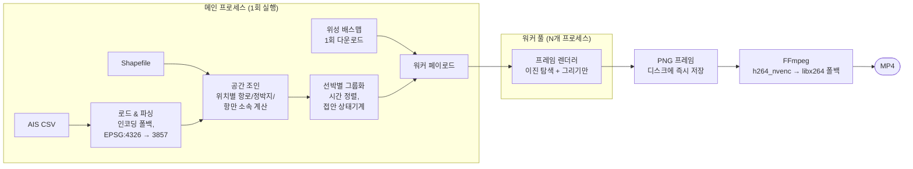

# 부산항 AIS 선박 행위 분석

**한국어** | [English](README.md)

> AIS 데이터 기반 부산항 선박 행위 식별 및 타임랩스 시각화


## 목차

- [배경](#배경)
- [데모](#데모)
- [주요 기능](#주요-기능)
- [행위 판정 규칙](#행위-판정-규칙)
- [아키텍처](#아키텍처)
- [시작하기](#시작하기)
- [입력 데이터](#입력-데이터)
- [설정 및 튜닝](#설정-및-튜닝)
- [공통 라이브러리 (`ais_common.py`)](#공통-라이브러리-ais_commonpy)
- [성능 설계](#성능-설계)
- [트러블슈팅](#트러블슈팅)
- [한계 및 로드맵](#한계-및-로드맵)
- [용어집](#용어집)
- [저장소 구조](#저장소-구조)

## 배경

부산항은 세계에서 가장 붐비는 컨테이너 항만 중 하나이며, 그 진입 수역에는 화물선, 유조선, 여객선, 예인선, 어선이 밀집되어 통항합니다. 모든 선박은 AIS(선박자동식별장치)로 위치·속력·침로를 지속적으로 송출하지만, 원시 AIS 로그는 결국 수백만 개의 시각별 점 데이터일 뿐입니다. 이 점들을 *행위*로 해석하는 것 — 이 배는 정박 중인가 표류 중인가? 고시 항로를 벗어났는가? 저 예인선은 실제로 예인작업 중인가? — 이 해상교통관제(VTS), 항만 안전 연구, 해상교통공학에서 데이터를 쓸모 있게 만드는 핵심입니다.

이 프로젝트가 바로 그 변환을 수행합니다. 고시 항로·정박지 폴리곤을 기준으로 단순하고 투명한 기하·운동학 규칙을 적용해 매초 선박의 상태를 분류하고, 전체 상황을 위성영상 위 타임랩스 영상으로 렌더링합니다. 분석가는 하루치 항만 교통을 수십 초 만에 *눈으로 보고* 이상 상황을 즉시 포착할 수 있습니다.

독립적인 두 파이프라인을 제공합니다.

| 파이프라인 | 스크립트 | 식별 대상 |
|---|---|---|
| 항행 상태 | `3docked_video_demo.py` | 정박, 정류, 항로이탈 |
| 운항 행위 | `2acting_video2_demo.py` | 접안/하역, 조업, 예인작업 |

## 데모

### 정박 / 정류 / 항로이탈 (`3docked_video_demo.py`)

매초 각 선박을 고시 항로·정박지 폴리곤과 대조해 분류합니다. 채운 원은 정박·정지 선박, 노란 테두리 원은 정류, 빨간 원은 방금 고시 항로를 벗어난 선박을 나타냅니다. 항해 중인 선박에는 SOG(대지속력) 라벨과 COG(대지침로) 화살표가 표시됩니다.


**관전 포인트:** 정박지 폴리곤 안에서 위치를 유지하는 선박(채운 점), 그 밖에서 느리게 표류하며 노란 정류 원이 붙는 선박, 그리고 선박 위치가 항로 경계를 밖으로 넘는 순간 나타나는 빨간 표시.

### 운항 행위 (`2acting_video2_demo.py`)

접안 상태는 선박별로 지속되는 상태로 추적하고, 조업은 선종과 속력으로, 예인작업은 예인선의 속력과 인접 선박 존재 여부(KD-tree 근접 탐색)로 추정합니다.


**관전 포인트:** GPS 흔들림에도 채운 점으로 안벽에 "붙어 있는" 접안 선박(상태기계가 실제 출항 전까지 상태를 유지), 저속 어선 주변의 파란 원, 그리고 예인선이 느리게 움직이면서 *동시에* 근처에 상대 선박이 있을 때만 나타나는 노란 원.

원본 해상도 MP4는 [`assets/`](assets/)에 있습니다.

## 주요 기능

- **규칙 기반의 설명 가능한 분류** — 화면의 모든 마커는 아래 규칙 표의 한 행으로 추적 가능. 블랙박스 없음
- **공식 지리정보 기반** — 임의 구역이 아닌 고시 항로·정박지·항만 폴리곤 대비 판정
- **출판 품질 출력** — Esri 위성영상 위 3000×2000 px 프레임, 한글 범례, H.264 MP4
- **빠른 처리** — 벡터화 공간 조인, 선박별 이진 탐색, 배스맵 캐싱, 멀티프로세싱 렌더링. 공간 연산은 핫 루프 밖으로 전부 이동
- **이식성** — Windows/Linux, 헤드리스(Agg) 렌더링, GPU 인코딩 + CPU 자동 폴백, 인코딩 폴백 CSV 로드(UTF-8/CP949)
- **튜닝 용이** — 모든 임계값이 각 스크립트 상단의 이름 있는 상수

## 행위 판정 규칙

### `3docked_video_demo.py` — 항행 상태

| 상태 | 조건 | 표시 |
|---|---|---|
| 정박 (정박지 내) | 고시 정박지 내 ∧ SOG ≤ 2.1노트 | 채운 원 |
| 정지 (정박지 외) | SOG ≤ 2.1노트 ∧ 200초 내 이동 ≤ 10 m 또는 침로 변화 ≥ 10° | 채운 원 |
| 정류 | SOG ≤ 2.1노트이나 정지로 보기 어려움 | 노란 테두리 원 |
| 항로이탈 | 직전 위치는 고시 항로 내 ∧ 현재 위치는 밖 (600초 이내) | 빨간 원 |
| 항해 중 | SOG > 2.1노트 | 방향 마커 + SOG 라벨 + COG 화살표 |

*왜 2.1노트인가?* 정박·접안 선박도 GPS 오차와 닻 회전(swinging)으로 잔여 SOG가 찍힙니다. 2.1노트는 이런 노이즈와 실제 저속 항해를 구분하는 실용적 기준입니다. 10 m / 10° 2차 판정은 실제로 위치를 유지하는(또는 닻줄에 매여 선회하는) 선박과 저속으로 이동 중인 선박을 구분합니다.

### `2acting_video2_demo.py` — 운항 행위

| 행위 | 조건 | 표시 |
|---|---|---|
| 접안 / 하역 | 해안선 100 m 버퍼 내 ∧ SOG ≤ 2.1노트 (SOG > 2.1노트가 될 때까지 상태 유지) | 채운 원 |
| 조업 | 어선 ∧ 0 ≤ SOG ≤ 5노트 | 파란 테두리 원 |
| 예인작업 | 예인선 ∧ 0.5 ≤ SOG ≤ 8노트 ∧ 약 570 m 내 다른 선박 존재 | 노란 테두리 원 |

*접안에 왜 지속 상태를 쓰는가?* 접안 선박의 AIS 위치는 해안 버퍼를 들락거리고 SOG는 0 근처에서 흔들립니다. 버퍼 진입 시 상태를 걸고(latch) 실제 출항(SOG > 2.1노트)이 확인될 때만 해제하면 이런 깜빡임이 사라집니다. 이 상태는 전처리 단계에서 선박별 시계열로부터 결정적으로 계산되므로, 프레임 병렬 처리 방식과 무관하게 결과가 재현됩니다.

*예인에 왜 근접 조건을 쓰는가?* 작업 속도로 이동하는 예인선이라도 주변에 상대 선박이 없으면 단순 이동일 뿐입니다. KD-tree 근접 판정(약 570 m)은 예인 상대가 있을 법한 경우에만 예인작업 표시를 그리게 합니다.

### 선종별 색상 (AIS 선종코드)

| 코드 | 선종 | 색상 |
|---|---|---|
| 30 | 어선 | blue |
| 31, 32, 50, 52 | 견인, 도선, 예인선 | yellow |
| 36, 37 | 요트, 유람선 | lime |
| 40–49, 60–69 | 여객, 쾌속선 | pink |
| 70–79 | 화물선 | orange |
| 80–89 | 유조선 | red |
| 그 외 | 미분류 | gray |

## 아키텍처



핵심 설계:

- **공간 연산 전체 사전 계산.** 항로/정박지/항만 소속 여부를 AIS 좌표별로 공간 조인(`geopandas.sjoin`) 1회로 계산하므로, 프레임 렌더 루프에서는 지오메트리 연산이 전혀 없습니다.
- **선박별 이진 탐색.** 항적을 MMSI별로 시간 정렬해 두고 각 프레임에서 `np.searchsorted`로 최신 위치를 찾습니다. 전체 데이터 필터링을 반복하지 않습니다.
- **Windows 안전 멀티프로세싱.** 무거운 데이터 로드는 메인 프로세스에서 1회만 수행하고 풀 initializer로 워커에 전달합니다. `spawn` 방식에서 워커마다 데이터가 재로딩되지 않습니다.
- **배스맵 1회 다운로드.** 위성 배스맵을 `contextily.bounds2img`로 한 번만 받아 모든 프레임에서 재사용합니다.
- **결정적 상태 계산.** 접안 상태는 선박별 시계열에서 forward-fill 상태기계로 계산하므로 프레임 처리 순서와 무관하게 재현 가능합니다.

## 시작하기

### 요구 사항

- Python ≥ 3.10, 패키지: `pandas`, `numpy`, `geopandas`, `shapely`, `matplotlib`, `contextily`, `scipy`, `pillow`, `tqdm`, `psutil`
- FFmpeg (`PATH` 또는 활성 conda 환경 — `<env>/Library/bin`도 자동 탐지)
- 한글 폰트 (나눔스퀘어 또는 맑은 고딕 자동 탐지)
- 첫 실행 시 인터넷 연결 (위성 배스맵 타일 다운로드)

### 설치

```bash
conda create -n ais python=3.10 geopandas contextily scipy pillow tqdm psutil ffmpeg -c conda-forge
conda activate ais
```

### 사용법

```bash
# 빠른 확인: 100프레임(영상 약 3초) 렌더링
python 3docked_video_demo.py

# 전체 실행: 정박 / 정류 / 항로이탈 영상
python 3docked_video_demo.py --frames 1000 --output dock_demo.mp4 --fps 30

# 운항 행위 영상
python 2acting_video2_demo.py --frames 1000 --output activity_demo.mp4 --fps 30
```

| 옵션 | 기본값 | 설명 |
|---|---|---|
| `--frames` | 100 | 렌더링할 1초 간격 프레임 수 |
| `--output` | 스크립트별 상이 | 출력 MP4 파일명 |
| `--fps` | 30 | 출력 영상 프레임레이트 |

프레임 하나가 시뮬레이션 시간 1초에 해당하므로, `--frames 1000 --fps 30`이면 실제 교통 약 17분이 33초 영상으로 압축됩니다(약 30배속 타임랩스).

## 입력 데이터

AIS 데이터와 고시 shapefile은 이 저장소에 **포함되어 있지 않습니다**. 스크립트는 작업 디렉터리에서 다음 파일을 찾습니다.

| 파일 | 내용 | 필수 컬럼 / 비고 |
|---|---|---|
| `busan_AIS2.csv` | AIS 동적 정보 | `MMSI`, `일시`, `경도`/`위도`(WGS 84), `SOG`, `COG`, `Heading` |
| `Static.csv` | 선박 정적 정보 | `MMSI`, `선종코드` |
| `항로.shp` | 고시 항로 | EPSG:4326 |
| `정박지.shp`, `항구.shp` | 정박지 / 무역항 | EPSG:4326, `3docked_video_demo.py`에서 사용 |
| `해안선버퍼.shp` | 해안선 100 m 버퍼 | EPSG:4326, `2acting_video2_demo.py`에서 사용 |

위 shapefile 이름은 예시입니다 — 각 스크립트 `main()`의 `load_shapes()` 호출 부분에서 실제 파일 경로를 지정하세요. 해당 항만의 AIS 데이터와 지리정보만 바꿔 넣으면 어떤 항만이든 분석할 수 있습니다. 파이프라인 자체에 부산 고유의 로직은 없습니다.

## 설정 및 튜닝

모든 판정 임계값은 각 스크립트 상단의 이름 있는 상수입니다. 자주 조정할 만한 항목:

| 상수 | 스크립트 | 기본값 | 값을 키우면 |
|---|---|---|---|
| `SOG_STOPPED` | `ais_common` | 2.1노트 | 더 많은 선박이 정지/접안으로 분류됨 |
| `STOP_DISTANCE_M` | `3docked` | 10 m | "위치 유지" 판정이 느슨해짐 |
| `TURN_THRESHOLD_DEG` | `3docked` | 10° | 닻 선회(swinging) 감지가 줄어듦 |
| `STOP_WINDOW_SEC` | `3docked` | 200초 | AIS 송출 간격이 긴 선박도 정지 판정 대상이 됨 |
| `DEPARTURE_WINDOW_SEC` | `3docked` | 600초 | 항로이탈 판정이 더 긴 송출 공백을 허용 |
| `PROXIMITY_RADIUS` | `2acting` | 약 570 m | 예인 상대 선박이 더 멀어도 인정 |
| `FISHING_SOG_MAX` | `2acting` | 5노트 | 더 빠른 어선도 조업으로 표시 |
| `TOWING_SOG_MIN/MAX` | `2acting` | 0.5–8노트 | 예인선 작업 속도 범위가 넓어짐 |
| `FRAME_STEP_SEC` | 공통 | 1초 | 시간 간격이 성겨져 영상이 짧고 빨라짐 |

렌더링 상수(그림 크기, DPI, 마커 크기, 화살표 길이)도 같은 블록에 있습니다. 크기 단위는 EPSG:3857 지도 좌표(이 위도에서 대략 미터)입니다.

## 공통 라이브러리 (`ais_common.py`)

두 파이프라인은 공통 라이브러리 위의 얇은 스크립트입니다.

| 함수 | 역할 |
|---|---|
| `load_ais_csv(path)` | 인코딩 폴백 CSV 로드, 시각 파싱, EPSG:3857 `x`/`y` 컬럼 추가 |
| `load_ship_colors(path)` | AIS 선종코드로부터 `MMSI → 표시 색상` 매핑 생성 |
| `load_shapes(*paths)` | shapefile 로드, EPSG:3857 재투영, 지오메트리 정리(`buffer(0)`) |
| `points_within(points, polys)` | 공간 조인 1회로 point-in-polygon 소속 벡터 계산 |
| `build_ship_groups(df)` | 프레임별 이진 탐색용 `MMSI → (정렬된 시각, 항적)` 생성 |
| `create_bar(...)` / `legend_*(...)` | 방향 선박 마커 및 범례 항목 빌더 |
| `heading_diff(a, b)` | 360° 랩어라운드를 처리한 최소 침로차 |
| `haversine(...)` | 대권 거리(m) |
| `fetch_basemap(...)` | 데이터 영역의 Esri 위성영상 1회 다운로드 |
| `run_ffmpeg(...)` | 프레임 시퀀스 인코딩. `h264_nvenc` 시도 후 `libx264` 폴백 |
| `setup_korean_font()` | OS별 한글 폰트 자동 등록 |

파이프라인 간에 일관되어야 하는 것(색상, 임계값, 지오메트리 처리)은 전부 이 파일에 한 번만 존재합니다.

## 성능 설계

이런 렌더러를 순진하게 구현하면 — 프레임마다 전체 데이터 필터링, 선박×폴리곤 전수 검사, 프레임마다 지도 타일 다운로드 — 계산량이 준제곱으로 늘고 네트워크에 발목을 잡힙니다. 각 비용을 핫 루프 밖으로 옮겼습니다.

| 병목 | 해결 |
|---|---|
| 프레임마다·워커마다 배스맵 타일 다운로드 | 메인 프로세스에서 `bounds2img` 1회 다운로드 후 initializer로 공유 |
| 프레임 × 선박마다 point-in-polygon | 전처리에서 전체 좌표에 대해 벡터화 `sjoin` 1회 |
| 프레임마다 전체 데이터 시간 필터링 | 선박별 시간 정렬 배열 + `np.searchsorted` (O(log n)) |
| 렌더링된 전체 프레임을 RAM에 보관 | 프레임을 임시 폴더에 즉시 저장 |
| Windows `spawn`이 워커마다 모듈 로드 재실행 | 모든 로드를 `main()` 안으로. 워커는 페이로드를 1회 수신 |
| 프레임 처리 순서에 따라 달라지는 접안 상태 | 전처리에서 결정적 forward-fill 상태기계로 계산 |

남은 프레임당 비용은 사실상 matplotlib 그리기 시간뿐이며, 프레임 간 공유 상태가 없어 워커 풀에서 깔끔하게 병렬화됩니다.

## 트러블슈팅

| 증상 | 원인과 해결 |
|---|---|
| `ffmpeg를 찾을 수 없습니다` / `FileNotFoundError` | FFmpeg가 `PATH`에 없음. 활성 conda 환경에 설치(`conda install ffmpeg -c conda-forge`). `<env>/Library/bin/ffmpeg.exe`는 자동 탐지됨 |
| `h264_nvenc ... 실패` 메시지 후 인코딩 계속 진행 | NVIDIA GPU가 없거나 FFmpeg 빌드가 오래된 경우의 정상 동작: 자동으로 `libx264`로 재시도하며 출력물은 동일 |
| 한글 범례가 □□□로 표시 | 한글 폰트 미발견. 나눔스퀘어 설치 또는 Windows 기본 맑은 고딕 사용. `setup_korean_font()`가 둘 다 탐색 |
| 배스맵 다운로드 실패 / 배경이 비어 있음 | 첫 실행에는 Esri World Imagery 타일 다운로드를 위한 인터넷 연결 필요. 재시도하거나 프록시 설정 확인. contextily가 첫 다운로드 후 타일을 캐싱 |
| 실행이 느리거나 메모리 사용량이 큼 | `--frames` 축소, DPI/그림 크기 상수 하향, 또는 AIS CSV를 관심 시간대로 잘라서 사용. 전처리 시간은 공간 조인이, 렌더링은 프레임 수 × 선박 수가 지배 |
| 영상 초반에 선박이 제자리에 멈춰 있음 | 정상 동작: 각 선박은 가장 최근 위치에 표시되므로, 시간 창 이전에 마지막 송출을 한 선박은 새 위치가 올 때까지 마지막 위치를 유지 |

## 한계 및 로드맵

**현재 한계**

- 규칙 기반 분류이며 임계값은 2022년 9월 부산 데이터에 맞춰져 있습니다. 다른 항만/계절에는 재튜닝이 필요할 수 있습니다([설정 및 튜닝](#설정-및-튜닝) 참고).
- 기존 영상과의 동일성을 위해 침로를 수학각 관례로 그립니다. 실제 나침반 방위 렌더링은 `create_bar(..., compass=True)`로 켤 수 있으나 기본값은 꺼짐입니다.
- `Heading = 511`(미수신) 등 AIS 특이값과 긴 송출 공백은 보정 없이 그대로 통과시킵니다.
- 1초 프레임 간격은 AIS 송출이 충분히 조밀하다고 가정합니다. 매우 성긴 항적은 계단식으로 보입니다.

**로드맵**

- [ ] 입력 파일 경로를 설정 파일 / CLI 인자로 외부화
- [ ] 나침반 방위 보정을 커맨드라인 플래그로 제공
- [ ] 영상과 함께 행위 이벤트 로그(시각 포함 CSV) 내보내기
- [ ] MP4 대안으로 인터랙티브 출력(deck.gl / kepler.gl)
- [ ] 규칙 기반 대비 벤치마크할 학습 기반 분류 모델

이슈와 풀 리퀘스트를 환영합니다.

## 용어집

| 용어 | 의미 |
|---|---|
| **AIS** | 선박자동식별장치 — 선박의 식별 정보·위치·운동 정보를 VHF로 방송 |
| **MMSI** | 해상이동업무식별부호 — 9자리 선박 고유 식별자 |
| **SOG** | 대지속력(Speed Over Ground), 노트 단위 |
| **COG** | 대지침로(Course Over Ground) — 실제 이동 방향 |
| **Heading** | 선수 방위 — 뱃머리가 향하는 방향 (바람·조류에 따라 COG와 다름). `511`은 미수신 |
| **항로** | 고시된 항행 수로 |
| **정박지** | 선박이 닻을 내릴 수 있도록 지정된 수역 |
| **EPSG:4326 / 3857** | WGS 84 경위도 / Web Mercator(미터 유사 단위) 좌표계 |

## 저장소 구조

```
├── ais_common.py             # 공통 라이브러리: 데이터 로드, 공간 조인, 마커,
│                             #   범례, 침로 유틸, FFmpeg 러너
├── 2acting_video2_demo.py    # 운항 행위 파이프라인 (접안 / 조업 / 예인)
├── 3docked_video_demo.py     # 항행 상태 파이프라인 (정박 / 정류 / 항로이탈)
└── assets/                   # 데모 GIF 및 원본 해상도 MP4
```

## 참고

- 배스맵 타일: [contextily](https://github.com/geopandas/contextily)를 통한 Esri World Imagery
- 판정 임계값(속력, 거리, 시간 창)은 각 스크립트 상단에 상수로 정의되어 있어 다른 항만이나 데이터셋에 맞게 조정할 수 있습니다.
