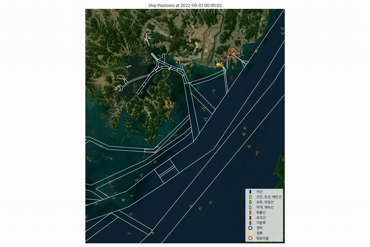
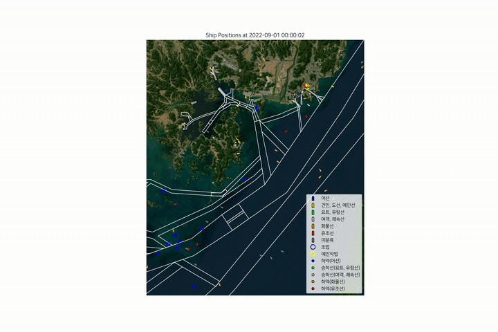
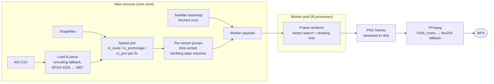

# Busan AIS Ship Behavior Analysis

[한국어](README.ko.md) | **English**

> AIS-based vessel behavior detection and time-lapse visualization for the Port of Busan, Korea.


## Table of contents

- [Background](#background)
- [Demo](#demo)
- [Features](#features)
- [Behavior classification rules](#behavior-classification-rules)
- [Architecture](#architecture)
- [Getting started](#getting-started)
- [Input data](#input-data)
- [Configuration & tuning](#configuration--tuning)
- [Shared library (`ais_common.py`)](#shared-library-ais_commonpy)
- [Performance design](#performance-design)
- [Troubleshooting](#troubleshooting)
- [Limitations & roadmap](#limitations--roadmap)
- [Glossary](#glossary)
- [Repository structure](#repository-structure)

## Background

The Port of Busan is one of the busiest container ports in the world, and its approaches carry a dense mix of cargo ships, tankers, passenger craft, tugs, and fishing vessels. Every one of them continuously broadcasts its position, speed, and course over AIS (Automatic Identification System) — but a raw AIS log is just millions of timestamped points. Turning those points into *behavior* (Is this ship anchored or drifting? Did it leave its designated fairway? Is that tug actually towing something?) is what makes the data useful for vessel traffic services, port safety studies, and maritime traffic engineering.

This project does exactly that transformation. It classifies each vessel's state second by second using simple, transparent geometric and kinematic rules against officially designated fairway and anchorage polygons, then renders the whole picture as a time-lapse video over satellite imagery — so an analyst can *watch* a day of port traffic unfold in seconds and immediately spot anomalies.

Two independent pipelines are provided:

| Pipeline | Script | Detects |
|---|---|---|
| Navigational status | `3docked_video_demo.py` | Anchoring, loitering, route deviation |
| Operational activity | `2acting_video2_demo.py` | Berthing/cargo handling, fishing, towing |

## Demo

### Anchoring / Loitering / Route deviation (`3docked_video_demo.py`)

Vessels are classified every second against designated fairway and anchorage polygons. Filled circles mark anchored/stationary ships, yellow rings mark loitering, red rings mark ships that have just left a designated route. Each moving vessel shows its SOG label and a COG vector arrow.



**What to look for:** ships holding position inside anchorage polygons (filled dots), slow drifters outside them picking up yellow loitering rings, and the red flash when a vessel's fix crosses a fairway boundary outward.

### Operational activity (`2acting_video2_demo.py`)

Berthing status is tracked as a persistent per-vessel state, fishing activity is inferred from vessel type and speed, and towing operations are inferred from tug speed plus proximity to another vessel (KD-tree neighbor search).



**What to look for:** vessels "sticking" to berths as filled dots that survive brief GPS jitter (the state machine holds until the ship actually gets under way), blue rings around slow fishing vessels, and yellow rings appearing only when a tug is both slow *and* has a companion vessel nearby.

Full-resolution MP4 versions are available in [`assets/`](assets/).

## Features

- **Rule-based, explainable classification** — every marker on screen traces back to one row of the rules tables below; no black boxes
- **Official geography aware** — detection runs against designated fairway, anchorage, and port polygons, not arbitrary zones
- **Publication-quality output** — 3000×2000 px frames on Esri World Imagery, Korean-labeled legend, H.264 MP4
- **Fast** — vectorized spatial joins, per-vessel binary search, cached basemap, and a multiprocessing render farm; all spatial predicates leave the hot loop
- **Portable** — Windows/Linux, headless (Agg) rendering, GPU encoding with automatic CPU fallback, encoding-tolerant CSV loading (UTF-8/CP949)
- **Tunable** — every threshold is a named constant at the top of each script

## Behavior classification rules

### `3docked_video_demo.py` — navigational status

| Status | Condition | Marker |
|---|---|---|
| Anchored (in anchorage) | Inside a designated anchorage ∧ SOG ≤ 2.1 kn | Filled circle |
| Stationary (outside) | SOG ≤ 2.1 kn ∧ moved ≤ 10 m or heading changed ≥ 10° within 200 s | Filled circle |
| Loitering | SOG ≤ 2.1 kn but not stationary | Yellow ring |
| Route deviation | Previous fix inside a designated route ∧ current fix outside, within 600 s | Red ring |
| Under way | SOG > 2.1 kn | Directional marker + SOG label + COG arrow |

*Why 2.1 kn?* Anchored and berthed ships still report residual SOG from GPS noise and swinging at anchor; 2.1 kn is a practical cutoff that separates that noise from genuine slow steaming. The 10 m / 10° secondary test distinguishes a ship truly holding position (or swinging on its anchor chain) from one creeping along at low speed.

### `2acting_video2_demo.py` — operational activity

| Activity | Condition | Marker |
|---|---|---|
| Berthing / cargo handling | Inside 100 m coastal buffer ∧ SOG ≤ 2.1 kn (state persists until SOG > 2.1 kn) | Filled circle |
| Fishing | Fishing vessel ∧ 0 ≤ SOG ≤ 5 kn | Blue ring |
| Towing operation | Tug ∧ 0.5 ≤ SOG ≤ 8 kn ∧ another vessel within ≈ 570 m | Yellow ring |

*Why a persistent state for berthing?* A berthed ship's AIS fixes wobble in and out of the coastal buffer and its SOG flickers around zero. Latching the state on entry and releasing it only when the ship demonstrably gets under way (SOG > 2.1 kn) eliminates that flicker. The state is computed deterministically from each vessel's own time series during preprocessing, so results are reproducible regardless of how frames are parallelized.

*Why proximity for towing?* A tug moving at working speed with no other vessel nearby is just transiting. The KD-tree neighbor test (≈ 570 m) requires a plausible tow partner before the towing marker is drawn.

### Vessel type color coding (AIS ship type code)

| Code | Category | Color |
|---|---|---|
| 30 | Fishing | blue |
| 31, 32, 50, 52 | Tug / pilot / towing | yellow |
| 36, 37 | Yacht / pleasure craft | lime |
| 40–49, 60–69 | Passenger / high-speed craft | pink |
| 70–79 | Cargo | orange |
| 80–89 | Tanker | red |
| other | Unclassified | gray |

## Architecture



Key design points:

- **All spatial predicates are precomputed.** Route/anchorage/port membership is resolved once per AIS fix with a vectorized spatial join (`geopandas.sjoin`), so the per-frame render loop does no geometry tests at all.
- **Per-vessel binary search.** Trajectories are grouped by MMSI and time-sorted; each frame locates the latest fix with `np.searchsorted` instead of filtering the full dataset.
- **Windows-safe multiprocessing.** Heavy data loading happens once in the main process and is shipped to workers through the pool initializer, so `spawn` does not re-execute it per worker.
- **Single basemap fetch.** The satellite basemap is downloaded once (`contextily.bounds2img`) and reused by every frame.
- **Deterministic state.** Berthing status is derived from each vessel's own time series (forward-filled state machine), independent of frame processing order.

### Multiprocessing & frame streaming

Frame rendering is embarrassingly parallel — every frame depends only on the preprocessed payload, never on another frame — so it maps directly onto a process pool:

```python
with Pool(processes=num_processes,
          initializer=init_worker, initargs=(payload,)) as pool:
    for i, img in enumerate(pool.imap(process_frame, range(total_frames),
                                      chunksize=10)):
        Image.fromarray(img).save(os.path.join(tmpdir, f'frame_{i:05d}.png'))
```

Each piece of this line is deliberate:

- **Worker count** — `min(physical_cores + 2, logical_cores)`. Rendering is CPU-bound, so the pool is sized to physical cores; the +2 oversubscription keeps cores busy while a worker is briefly stalled on memory allocation or page faults.
- **`initializer` / `initargs`** — the payload (per-vessel groups, cached basemap, color map, bbox) is pickled and delivered to each worker **once at pool startup**, then kept in a module-level global. Without this, the data would either be re-pickled for every single task or — worse, on Windows `spawn`, which inherits nothing — reloaded from disk in every worker. Workers also re-register the Korean font here, since font state is per-process.
- **`imap` instead of `map`** — `map` blocks until *all* results are ready and materializes the full result list: at 3000×2000×3 bytes ≈ 18 MB per frame, a 1000-frame run would hold ~18 GB of pixels in RAM. `imap` returns a lazy iterator that yields each frame as soon as it is ready, so the main process saves the PNG, drops the array, and memory stays flat at O(workers) frames. It also lets the tqdm progress bar advance in real time.
- **`imap` instead of `imap_unordered`** — `imap` preserves submission order, so the `enumerate` index always matches the frame's position in time and `frame_%05d.png` numbering is correct by construction. `imap_unordered` would deliver slightly better latency but would require threading the frame index through every result to avoid scrambled video.
- **`chunksize=10`** — each task argument is just an `int`, so per-task IPC overhead would dominate with the default chunk size of 1. Batching 10 frames per dispatch amortizes the pickling/queue round-trips; the value only needs to be small relative to `total_frames / workers` so the pool stays load-balanced at the tail.
- **Headless rendering** — the library forces matplotlib's `Agg` backend before `pyplot` is touched, so workers never try to open a GUI canvas; each frame builds one figure and closes it, leaving no shared drawing state between tasks.
- **Fault tolerance by shape** — because frames are written straight to a temporary directory and FFmpeg runs only after the pool drains, a crashed run leaves nothing half-encoded; re-running is idempotent.

## Getting started

### Requirements

- Python ≥ 3.10 with: `pandas`, `numpy`, `geopandas`, `shapely`, `matplotlib`, `contextily`, `scipy`, `pillow`, `tqdm`, `psutil`
- FFmpeg on `PATH` (or in the active conda environment — the runner also checks `<env>/Library/bin`)
- A Korean-capable font (NanumSquare or Malgun Gothic is auto-detected)
- Internet access on first run (satellite basemap tiles)

### Installation

```bash
conda create -n ais python=3.10 geopandas contextily scipy pillow tqdm psutil ffmpeg -c conda-forge
conda activate ais
```

### Usage

```bash
# Quick check: render 100 frames (~3 s of video)
python 3docked_video_demo.py

# Full run: anchoring / loitering / route deviation video
python 3docked_video_demo.py --frames 1000 --output dock_demo.mp4 --fps 30

# Operational activity video
python 2acting_video2_demo.py --frames 1000 --output activity_demo.mp4 --fps 30
```

| Option | Default | Description |
|---|---|---|
| `--frames` | 100 | Number of 1-second frames to render |
| `--output` | script-specific | Output MP4 filename |
| `--fps` | 30 | Output video frame rate |

Each frame advances simulation time by one second, so `--frames 1000 --fps 30` compresses ~17 minutes of real traffic into a 33-second video (≈ 30× time-lapse).

## Input data

The AIS data and official shapefiles are **not** included in this repository. The scripts expect the following files in the working directory:

| File | Content | Required columns / notes |
|---|---|---|
| `busan_AIS2.csv` | Dynamic AIS fixes | `MMSI`, `일시` (timestamp), `경도`/`위도` (lon/lat, WGS 84), `SOG`, `COG`, `Heading` |
| `Static.csv` | Static vessel info | `MMSI`, `선종코드` (AIS ship type code) |
| `항로.shp` | Designated fairways | EPSG:4326 |
| `정박지.shp`, `항구.shp` | Anchorages / trade port | EPSG:4326, used by `3docked_video_demo.py` |
| `해안선버퍼.shp` | 100 m coastal buffer | EPSG:4326, used by `2acting_video2_demo.py` |

Shapefile names above are placeholders — point the `load_shapes()` calls in each script's `main()` to your own files. Any port can be analyzed by swapping in that port's AIS extract and geography; nothing in the pipeline is Busan-specific except the input files.

## Configuration & tuning

All detection thresholds are named constants at the top of each script. The most useful knobs:

| Constant | Script | Default | Effect of raising it |
|---|---|---|---|
| `SOG_STOPPED` | `ais_common` | 2.1 kn | More ships counted as stopped/berthed |
| `STOP_DISTANCE_M` | `3docked` | 10 m | Looser "holding position" test |
| `TURN_THRESHOLD_DEG` | `3docked` | 10° | Swinging at anchor detected less often |
| `STOP_WINDOW_SEC` | `3docked` | 200 s | Sparser AIS reporting still qualifies for the stationary test |
| `DEPARTURE_WINDOW_SEC` | `3docked` | 600 s | Route-deviation flag tolerates longer report gaps |
| `PROXIMITY_RADIUS` | `2acting` | ≈ 570 m | Towing partner may be farther away |
| `FISHING_SOG_MAX` | `2acting` | 5 kn | Faster fishing vessels still flagged as fishing |
| `TOWING_SOG_MIN/MAX` | `2acting` | 0.5–8 kn | Wider tug working-speed band |
| `FRAME_STEP_SEC` | both | 1 s | Coarser time step → shorter, faster-moving video |

Rendering constants (figure size, DPI, marker sizes, arrow length) live in the same blocks. Sizes are expressed in EPSG:3857 map units (≈ meters at this latitude).

## Shared library (`ais_common.py`)

The two pipelines are thin scripts over a common library:

| Function | Purpose |
|---|---|
| `load_ais_csv(path)` | Encoding-tolerant CSV load, timestamp parsing, EPSG:3857 `x`/`y` columns |
| `load_ship_colors(path)` | `MMSI → display color` from AIS ship type codes |
| `load_shapes(*paths)` | Read shapefiles, reproject to EPSG:3857, clean geometries (`buffer(0)`) |
| `points_within(points, polys)` | Vectorized point-in-polygon membership via one spatial join |
| `build_ship_groups(df)` | `MMSI → (sorted timestamps, trajectory)` for per-frame binary search |
| `create_bar(...)` / `legend_*(...)` | Directional ship marker and legend entry builders |
| `heading_diff(a, b)` | Minimal angular difference with 360° wraparound |
| `haversine(...)` | Great-circle distance in meters |
| `fetch_basemap(...)` | One-shot Esri World Imagery download for the data extent |
| `run_ffmpeg(...)` | Frame-sequence encoding; tries `h264_nvenc`, falls back to `libx264` |
| `setup_korean_font()` | Cross-platform Korean font registration for matplotlib |

Anything that needs to be consistent across pipelines (colors, thresholds, geometry handling) lives here exactly once.

## Performance design

The naive implementation of this kind of renderer — filter the whole dataset per frame, test every ship against every polygon, download map tiles per frame — is quadratic-ish and network-bound. Each of those costs was moved out of the hot loop:

| Bottleneck | Resolution |
|---|---|
| Basemap tiles downloaded per frame, per worker | Single `bounds2img` fetch in the main process, shared via pool initializer |
| Point-in-polygon per ship × per frame | One vectorized `sjoin` over all fixes during preprocessing |
| Full-dataset time filter per frame | Per-vessel time-sorted arrays + `np.searchsorted` (O(log n)) |
| All rendered frames held in RAM | Frames streamed straight to a temporary directory |
| Windows `spawn` re-running module-level loads in every worker | All loads inside `main()`; workers receive a pickled payload once |
| Frame-order-dependent berthing state | Deterministic forward-fill state machine in preprocessing |

The remaining per-frame cost is almost purely matplotlib drawing time, which parallelizes cleanly across the worker pool (one figure per frame, no shared state).

## Troubleshooting

| Symptom | Cause & fix |
|---|---|
| `ffmpeg를 찾을 수 없습니다` / `FileNotFoundError` | FFmpeg is not on `PATH`. Install it in the active conda env (`conda install ffmpeg -c conda-forge`) — the runner also auto-detects `<env>/Library/bin/ffmpeg.exe`. |
| `h264_nvenc ... failed` messages, then encoding continues | Expected on machines without a (recent) NVIDIA GPU or with an older FFmpeg build: the runner automatically retries with `libx264`. The output is equivalent. |
| Korean legend shows □□□ (tofu) | No Korean font found. Install NanumSquare or use Windows' bundled Malgun Gothic; `setup_korean_font()` searches both. |
| Basemap download fails / blank background | First run needs internet access for Esri World Imagery tiles. Retry, or check proxy settings; contextily caches tiles after the first fetch. |
| Run is slow or memory-heavy | Reduce `--frames`, lower the DPI/figure size constants, or trim the AIS CSV to the time window of interest. Preprocessing time is dominated by the spatial join; rendering scales with frames × ships. |
| Ships frozen in place at video start | Expected: each ship appears at its most recent fix, so vessels that reported before the window opened hold their last position until a new fix arrives. |

## Limitations & roadmap

**Current limitations**

- Classification is rule-based with thresholds tuned on a September 2022 Busan extract; other ports/seasons may need retuning (see [Configuration & tuning](#configuration--tuning)).
- Headings are drawn in math-angle convention to preserve parity with the original videos; true compass-bearing rendering is available via `create_bar(..., compass=True)` but is off by default.
- AIS quirks such as `Heading = 511` (not available) and long reporting gaps are carried through rather than imputed.
- The 1 Hz frame step assumes reasonably dense AIS sampling; very sparse trajectories will look stepwise.

**Roadmap**

- [ ] Externalize input file paths into a config file / CLI arguments
- [ ] Optional compass-bearing correction as a command-line flag
- [ ] Event log export (CSV of detected behaviors with timestamps) alongside the video
- [ ] Interactive output (deck.gl / kepler.gl) as an alternative to MP4
- [ ] Learned classification models benchmarked against the rule set

Issues and pull requests are welcome.

## Glossary

| Term | Meaning |
|---|---|
| **AIS** | Automatic Identification System — VHF broadcast of a vessel's identity, position, and kinematics |
| **MMSI** | Maritime Mobile Service Identity — 9-digit unique vessel identifier |
| **SOG** | Speed Over Ground, in knots |
| **COG** | Course Over Ground — direction of actual movement |
| **Heading** | Direction the bow points (differs from COG under wind/current); `511` means not available |
| **Fairway (항로)** | Officially designated navigation channel |
| **Anchorage (정박지)** | Designated area where vessels may anchor |
| **EPSG:4326 / 3857** | WGS 84 lon-lat / Web Mercator (meter-like map units) coordinate systems |

## Repository structure

```
├── ais_common.py             # Shared library: data loading, spatial joins, markers,
│                             #   legends, heading utilities, FFmpeg runner
├── 2acting_video2_demo.py    # Operational activity pipeline (berthing / fishing / towing)
├── 3docked_video_demo.py     # Navigational status pipeline (anchoring / loitering / deviation)
└── assets/                   # Demo GIFs and full-resolution MP4s
```

## Notes

- Basemap tiles: Esri World Imagery via [contextily](https://github.com/geopandas/contextily).
- Detection thresholds (speed, distance, time windows) are defined as constants at the top of each script and can be tuned for other ports or datasets.
